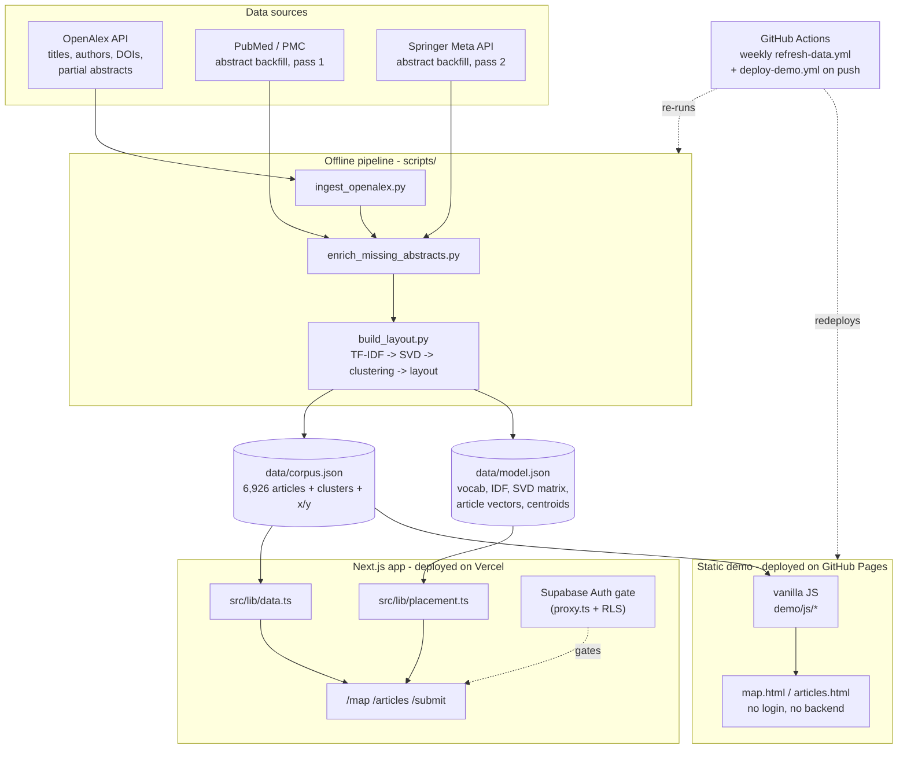
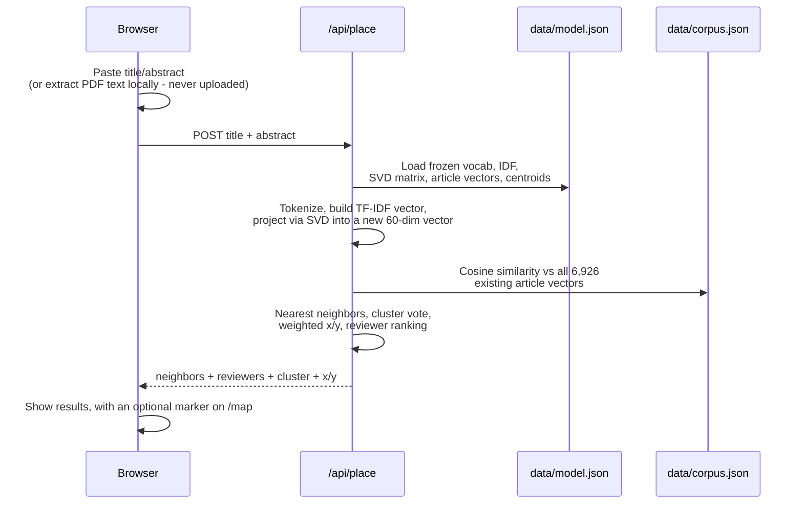

# Published Landscape

Behavior-analysis journal articles, organized by topic instead of chronology.

Journals are normally browsed chronologically - which makes it hard for an
editor to find who's written on a given topic beyond the names they already
know. This project takes the last 10 years of 7 behavior-analysis journals,
places every article in a "topic space" by what it's actually about, and
lets readers browse by theme and associate editors find reviewers by
expertise instead of by memory.

Current corpus: **6,926 articles**, **92.5% with a real abstract**, **12
journals**, **52 topics**, **11,614 authors**.

## What's here

- **Topic map** (`/map`) - every article placed by what it's about, not when
  it was published. Click a point for the full abstract, DOI, and related
  work. Click a topic in the legend to isolate it; click again to restore.
- **Articles** (`/articles`) - search/filter by journal, topic, year.
- **See where a new article lands** (`/submit`) - paste (or upload a PDF to
  autofill) a manuscript's title/abstract to project it into the same topic
  space, see the nearest existing articles (for spotting overlap), get a
  ranked list of candidate reviewers (authors of those nearest articles, with
  DOI links to find corresponding-author contact info), and view it as a
  marker on the topic map. PDF text never leaves the browser - only the
  extracted/edited text does.
- **Admin** (`/admin`, admins only) - who has an account, their role, when
  they last signed in, and a log of recent sign-ins; invite and remove people.
- Whole site is gated behind Supabase Auth (invite-only magic link) - see
  [Auth setup](#auth-setup).

A public, read-only, un-gated version of the topic map/articles/reviewers
lives as a static demo (vanilla HTML/JS, no backend) deployed to GitHub
Pages - see [Static demo](#static-demo).

## Architecture at a glance

How the data gets from journal APIs to the two deployed sites:



And what happens on a single `/submit` request - the frozen model from the
pipeline above gets reused rather than recomputed:



## How the data were gathered

**Journals** (`scripts/ingest_openalex.py`): Journal of Applied Behavior
Analysis, Behavior Analysis in Practice, Behavioral Interventions, Journal
of the Experimental Analysis of Behavior, Perspectives on Behavior Science,
The Analysis of Verbal Behavior, The Psychological Record, Behavior
Analysis: Research and Practice. The last 10 years
of each is pulled from the free [OpenAlex](https://openalex.org) API
(title, authors, year, DOI, and abstract where OpenAlex has one), filtered
to `type:article|review` and a title-pattern denylist (issue front matter,
"Call for Nominations," "Correction to:," etc. - things OpenAlex sometimes
misclassifies as articles).

**Abstract backfill** (`scripts/enrich_missing_abstracts.py`): OpenAlex/
Crossref only carry abstracts for a small fraction of the Springer-published
journals here (Behavior Analysis in Practice, Perspectives on Behavior
Science, The Analysis of Verbal Behavior, The Psychological Record - as low
as ~10% for some). This script closes most of that gap in two passes:

1. **PubMed/PMC** (NCBI E-utilities) - free, keyless, unambiguously open to
   automated access. Matched by DOI, verified against the returned record's
   own DOI field before accepting a match.
2. **Springer Nature's Meta API** (dev.springernature.com, free
   registration, `SPRINGER_META_API_KEY`) as a fallback for whatever PubMed
   doesn't have - Springer's own sanctioned metadata/abstracts API, not
   scraping their site (their `robots.txt` explicitly disallows AI-agent
   crawlers by name, so this deliberately goes through their API instead).

This took overall abstract coverage from ~61% to 97.4%, and Behavior
Analysis in Practice specifically from ~10% to ~98%. The remainder (mostly
tributes/errata with no abstract anywhere, or capped by Springer's 500/day
free-tier quota on a given run) fall back to OpenAlex's own computed
topic/keyword tags for clustering - the app flags these explicitly wherever
an abstract would show, so a thin placement is visible rather than silently
looking wrong.

`.github/workflows/refresh-data.yml` re-runs ingestion + backfill + the
topic model every Monday and commits the result if anything changed, which
in turn redeploys the static demo. New online-first articles are typically
indexed by OpenAlex/Crossref within a few days of publication.

## How the topic model was built

`scripts/build_layout.py` turns the corpus into a topic map in four steps:

1. **Document text**: title (repeated 3x, so it dominates) + abstract. For
   the minority of articles with no abstract, falls back to title + OpenAlex's
   own topic/keyword tags instead (still real signal, just thinner).
2. **TF-IDF**: a ~11,300-term vocabulary (terms appearing in 3 to 40% of
   documents - rare enough to be informative, common enough to be reliable),
   weighted by log-scaled term frequency times inverse document frequency.
3. **Truncated SVD to 60 dimensions** - this 60-number vector per article is
   the actual "embedding": cosine distance between two articles' vectors is
   what "similar topic" means everywhere in this app (nearest neighbors,
   reviewer suggestions, cluster assignment). Nothing downstream uses a
   neural embedding model; this is a from-scratch linear-algebra pipeline,
   deterministic and reproducible without an API key.
4. **Clustering + layout**: Ward-linkage hierarchical clustering into 52
   topics, each auto-labeled by the terms most characteristic of it (mean
   in-cluster TF-IDF minus mean out-of-cluster, so a topic is named by what
   separates it rather than by the corpus-wide background vocabulary).
   Average linkage was the earlier choice and chained badly here, collapsing
   every animal-behavior study into one 1,109-article cluster no label could
   describe; Ward splits that into foraging, mating, vocal communication,
   social groups, animal personality, and rodent stress models. The
   2D map position is a separate, purely visual step on top of the 60-dim
   embedding - a two-level "island" layout (cluster centroids placed via
   classical MDS and pushed apart so they don't overlap, then each cluster's
   own members locally laid out around its centroid). A single global
   MDS/t-SNE over 6,926 points tends to produce one soft continuous blob;
   doing it per-cluster is what makes the map read as separated, legible
   topic islands instead.

This whole pipeline (and the "place a new article" projection below) is
pure NumPy/SciPy - see `scripts/build_layout.py` for the exact math.

## How a new submission gets placed

`/submit` doesn't re-run the pipeline above - the fitted model (vocabulary,
IDF weights, the SVD projection matrix, every existing article's 60-dim
vector, and each cluster's centroid) is frozen into `data/model.json` when
`build_layout.py` runs, and `src/lib/placement.ts` reuses it:

1. Tokenize the submitted title/abstract the same way the corpus was
   tokenized, build a TF-IDF vector over the *existing* frozen vocabulary
   (no re-fitting), and project it through the *existing* frozen SVD matrix
   to get a 60-dim vector in the same space as everything else.
2. Cosine-similarity that vector against all 6,926 existing article vectors
   (a few thousand dot products - milliseconds, no retraining).
3. Assign a topic by similarity-weighted majority vote among the nearest
   neighbors (not nearest cluster centroid - centroid similarity can point
   to a different cluster than where the actual nearest articles sit,
   which read as inconsistent next to the neighbor list shown alongside it).
4. Approximate a map position as a similarity-weighted average of the
   nearest neighbors' real x/y coordinates (no full re-layout).
5. Build the reviewer list from a wider pool (~30 neighbors): sum each
   co-author's similarity across every one of their papers in that pool, so
   someone with two decent matches can outrank someone with one great one.

Nothing is persisted - it's a stateless request/response, and the PDF (if
used) never leaves the browser; only the extracted/edited text is sent.
This math was checked before shipping by re-projecting a real, already-
published article's own text through the pipeline and confirming it
reproduced that article's own precomputed nearest neighbors exactly.

## Static demo

`demo/` is a from-scratch vanilla HTML/CSS/JS port of the topic map,
article browser, and article detail pages - no framework, no login, no
backend, reading `data/corpus.json` directly via `fetch`. It's what's
deployed to GitHub Pages (`.github/workflows/deploy-demo.yml`, triggered on
any push touching `demo/**` or `data/corpus.json`) so the landscape is
viewable by anyone with a link, without needing Supabase or Vercel set up.
It intentionally does not include the `/submit` placement feature or
reviewer suggestions.

## Deployment

Both deploy targets redeploy automatically on push to `main` - nothing
manual required for either one:

- **Vercel** (the gated app) is connected via Vercel's native Git
  integration (Project Settings > Git), so any push, including the
  automated weekly data-refresh commit, triggers a new production
  deployment on its own.
- **GitHub Pages** (the static demo) redeploys via
  `.github/workflows/deploy-demo.yml`, triggered on pushes touching
  `demo/**` or `data/corpus.json`.

So the weekly refresh (`refresh-data.yml`) commits new data once a week,
and that single push fans out to both: Vercel picks it up natively, and it
matches `deploy-demo.yml`'s path filter to redeploy the demo too.

## Running locally

```bash
npm install
npm run dev
```

Works out of the box with no setup - the login gate auto-disables (with a
visible banner) until Supabase is configured, and reads the same
`data/corpus.json`/`data/model.json` the deployed app uses.

## Auth setup

The whole site is gated behind Supabase Auth (invite-only magic link - no
public signup). To turn it on:

1. Create a free project at [supabase.com/dashboard](https://supabase.com/dashboard).
2. In the SQL Editor, run the files in `supabase/migrations/` in order. There
   is no direct-connection host for newer Supabase projects, so `psql` from a
   laptop needs the exact string from Project Settings > Database; the SQL
   Editor is the path of least resistance for DDL.
3. In Project Settings, copy the Project URL, `anon`/publishable key, and
   `service_role`/secret key into `.env.local` (see `.env.local.example`). The
   `service_role` key must also be set in the Vercel project's environment
   variables - without it `/admin` returns 404 to everyone, including admins
   (with a `console.warn` explaining why, since the symptom is otherwise
   inscrutable).
4. In Authentication > URL Configuration, set Site URL to your deployed URL
   and add `<your-url>/auth/confirm` (and `http://localhost:3000/auth/confirm`
   for local dev) to Redirect URLs - Supabase's own default Site URL
   (`localhost:3000`) otherwise silently overrides the redirect you ask for.
5. Promote your own account to admin. This one has to happen in SQL: `/admin`
   is the place to manage roles, but only an admin can reach it, so the first
   admin can't be made there.
   `update profiles set role = 'admin' where email = 'you@example.com';`
6. From then on, invite people from `/admin` (or Authentication > Users >
   Invite user).
7. Optionally configure custom SMTP (Authentication > Emails > SMTP
   Settings) so invite/magic-link emails send from your own domain instead
   of Supabase's rate-limited shared sender.

### Roles

`profiles.role` is one of `ae`, `eic`, or `admin`. Reviewers never sign in -
they are people the tool *suggests*, not users - so there is no reviewer role.

| Role | Map / articles / submit | `/admin` |
| --- | --- | --- |
| `admin` | all 12 journals | everyone; the only role that can delete accounts |
| `eic` | all 12 journals | their own journal's AEs: invite, deactivate, reactivate |
| `ae` | all 12 journals | no access |

**Journal affiliation (`profiles.journal_id`) is an administrative boundary,
not a content one.** Everyone browses all 12 journals; cross-journal reviewer
discovery is the point of the tool, and capping an EiC to their own journal
would mean a JABA editor could only ever be shown JABA authors. What
`journal_id` decides is whose accounts an EiC can see and change. Admins have
no journal; an EiC must have one (`profiles_eic_needs_journal`).

`src/lib/users.ts` holds the one authority on this - `canManage()` and
`assignableRoles()`. Both the page (what to render) and every Server Action
(what to allow) call them, so the UI can't drift out of step with what's
actually enforced. Actions also re-read the target's current role and journal
from the database rather than trusting the submitted form, since a Server
Action is reachable by direct POST.

**Offboarding** is deactivation, not deletion: guest AEs rotate by special
issue, so `profiles.active` frees a seat while keeping the person's history and
reactivating is one click. It's enforced twice - the account is banned at the
Supabase auth level so no new token is issued, and `(app)/layout.tsx` checks
the flag so a user with an unexpired token drops out on their next page view.
Deletion stays admin-only and is irreversible.

`/admin` reads sign-in times from `auth.users` (all time) and a per-sign-in log
from `login_events`, which the app writes itself. Supabase's own
`auth.audit_log_entries` records the same events but is pruned on a rolling
window and isn't reachable from the REST API, so it can't answer questions
about past quarters. `login_events` only covers sign-ins since migration 0004.

Two deliberate limits in the panel: you can't change your own role, deactivate
yourself, or delete your own account (the changes that can lock the last admin
out, recoverable only via SQL), and the role dropdown is uncontrolled - after a
successful save it may keep displaying the previous value until the page is
reloaded.

See `supabase/README.md` for the condensed version of the same steps.

## Data pipeline reference

```
scripts/ingest_openalex.py           # fetch 10 years of articles from OpenAlex -> data/corpus.json
scripts/enrich_missing_abstracts.py  # backfill missing abstracts: PubMed first, then Springer Meta API
scripts/build_layout.py              # TF-IDF -> SVD -> clustering -> topic map coords + data/model.json
```

Re-run all three in order to refresh the corpus (`pip install numpy scipy
requests` first; `SPRINGER_META_API_KEY` env var needed for the second).
`data/corpus.json` and `data/model.json` are the single sources of truth for
this mockup - the Next.js app (`src/lib/data.ts`, `src/lib/placement.ts`)
reads them directly, no database required to run. `scripts/load_supabase.py`
can push the same corpus into Postgres once a Supabase project exists, for
moving off the static-JSON data layer.

## Stack

Next.js 16 (App Router) + Tailwind, Supabase (Postgres + Auth), deployed on
Vercel. Static-JSON data layer for now (see above) rather than the Postgres
schema being the live read path, even though both the schema and an
RLS-secured Supabase Auth gate are fully wired up.
