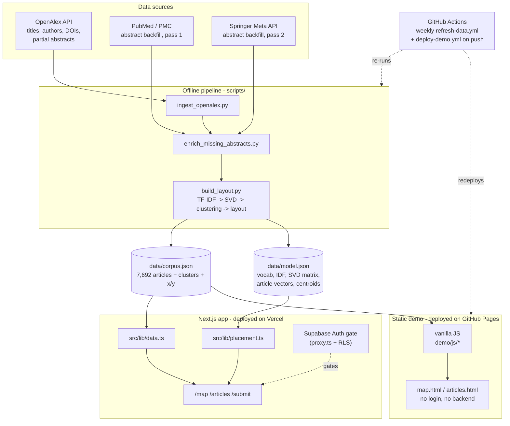
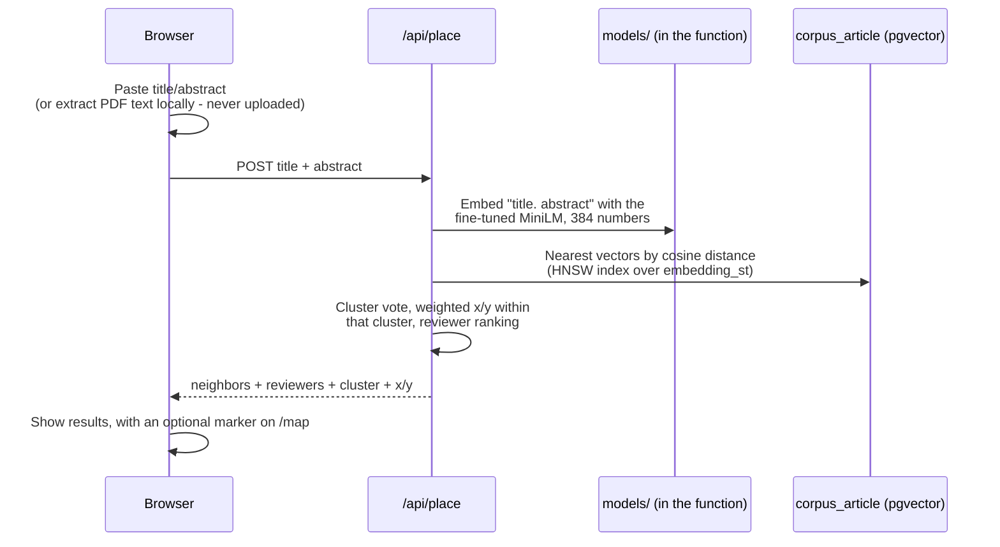

# Published Landscape

Behavior-analysis journal articles, organized by topic instead of chronology.

Journals are normally browsed chronologically - which makes it hard for an
editor to find who's written on a given topic beyond the names they already
know. This project takes the last 10 years of 7 behavior-analysis journals,
places every article in a "topic space" by what it's actually about, and
lets readers browse by theme and associate editors find reviewers by
expertise instead of by memory.

## Where the literature comes from

Since 3 September 2026 this app reads its corpus from the Writer's Trellis
database (the `writers-trellis` project) rather than from files in `data/`.
That project forked the pipeline below and kept going: 46,000 articles across
35 years and 22 journals, vectors in pgvector, and the citation edges from
every review in the corpus. The two apps now share one corpus, rebuilt every
Monday by that project's `refresh-corpus.yml`, and a feature built against it
there can be brought here without a data port.

The app connects as `corpus_reader`, a role that can `SELECT` from the six
`corpus_*` tables and reach nothing else (see
`writers-trellis/scripts/create-corpus-reader.sql`). Set `CORPUS_DATABASE_URL`
to that role's pooled Neon connection string. Two optional variables narrow
what is shown without changing what is stored: `CORPUS_YEARS_BACK` keeps the
last N years (default 10, the window this app always had) and
`CORPUS_JOURNALS` is a comma-separated list of ISSN-Ls (default: the
behavior-analytic journals listed in `src/lib/corpus-db.ts`, which leaves out
the seven developmental-disability and autism journals the Trellis corpus
carries for review searches). `all` on either shows everything in the corpus.

`src/lib/data.ts` and `src/lib/placement.ts` are the only files that query it.
Placement embeds a manuscript with the same model that embedded the corpus
(`src/lib/embed.ts`, run inside the function, so the text goes nowhere else)
and asks pgvector for the nearest articles. See [How the topic model is
built](#how-the-topic-model-is-built) and [The query
embedder](#the-query-embedder).

The pipeline scripts in `scripts/` and the files in `data/` remain for the
static GitHub Pages demo, which has no database. They no longer feed the app,
though `build_layout.py`'s labeller and island layout are what the Trellis
pipeline still calls to name and draw the clusters.

Previous corpus, still used by the demo: **7,692 articles**, **93.1% with a
real abstract**, **14 journals**, **52 topics**, **12,670 authors**.

## What's here

- **Topic map** (`/map`) - every article placed by what it's about, not when
  it was published. Click a point for the full abstract, DOI, and related
  work. Click a topic in the legend to isolate it; click again to restore.
- **Articles** (`/articles`) - search/filter by journal, topic, year.
- **See where a new article lands** (`/submit`) - paste (or upload a PDF to
  autofill) a manuscript's title/abstract to project it into the same topic
  space, see the nearest existing articles (for spotting overlap), get a
  ranked list of candidate reviewers (authors of those nearest articles, with
  DOI links to find corresponding-author contact info), and view it as a
  marker on the topic map. PDF text never leaves the browser - only the
  extracted/edited text does.
- **Admin** (`/admin`, admins only) - who has an account, their role, when
  they last signed in, and a log of recent sign-ins; add, reissue passwords
  for, and remove people.
- Whole site is gated behind Supabase Auth (invite-only, email + password) -
  see [Auth setup](#auth-setup).

A public, read-only, un-gated version of the topic map/articles/reviewers
lives as a static demo (vanilla HTML/JS, no backend) deployed to GitHub
Pages - see [Static demo](#static-demo).

## Architecture at a glance

How the data gets from journal APIs to the two deployed sites:


```mermaid
flowchart TB
    subgraph Sources["Data sources"]
        OA["OpenAlex API<br/>titles, authors, DOIs,<br/>partial abstracts"]
        PM["PubMed / PMC<br/>abstract backfill, pass 1"]
        SP["Springer Meta API<br/>abstract backfill, pass 2"]
    end

    subgraph Pipeline["Offline pipeline - scripts/"]
        ING["ingest_openalex.py"]
        ENR["enrich_missing_abstracts.py"]
        BLD["build_layout.py<br/>TF-IDF -&gt; SVD -&gt; clustering -&gt; layout"]
    end

    OA --> ING --> ENR
    PM --> ENR
    SP --> ENR
    ENR --> BLD

    BLD --> CORPUS[("data/corpus.json<br/>7,692 articles + clusters + x/y")]
    BLD --> MODEL[("data/model.json<br/>vocab, IDF, SVD matrix,<br/>article vectors, centroids")]

    subgraph App["Next.js app - deployed on Vercel"]
        DATA["src/lib/data.ts"]
        PLACE["src/lib/placement.ts"]
        AUTH["Supabase Auth gate<br/>(proxy.ts + RLS)"]
        PAGES["/map  /articles  /submit"]
    end

    subgraph Demo["Static demo - deployed on GitHub Pages"]
        VJS["vanilla JS<br/>demo/js/*"]
        DPAGES["map.html / articles.html<br/>no login, no backend"]
    end

    CORPUS --> DATA --> PAGES
    MODEL --> PLACE --> PAGES
    AUTH -.gates.-> PAGES
    CORPUS --> VJS --> DPAGES

    GH["GitHub Actions<br/>weekly refresh-data.yml<br/>+ deploy-demo.yml on push"]
    GH -. re-runs .-> Pipeline
    GH -. redeploys .-> Demo
```

The diagram above is the demo's pipeline. The app itself reads the Trellis
database, and a single `/submit` request goes like this:


```mermaid
sequenceDiagram
    participant U as Browser
    participant API as /api/place
    participant M as models/ (in the function)
    participant DB as corpus_article (pgvector)

    U->>U: Paste title/abstract<br/>(or extract PDF text locally - never uploaded)
    U->>API: POST title + abstract
    API->>M: Embed "title. abstract" with the<br/>fine-tuned MiniLM, 384 numbers
    API->>DB: Nearest vectors by cosine distance<br/>(HNSW index over embedding_st)
    API->>API: Cluster vote, weighted x/y within<br/>that cluster, reviewer ranking
    API-->>U: neighbors + reviewers + cluster + x/y
    U->>U: Show results, with an optional marker on /map
```

## How the data were gathered

**Journals** (`scripts/ingest_openalex.py`): Journal of Applied Behavior
Analysis, Behavior Analysis in Practice, Behavioral Interventions, Journal
of the Experimental Analysis of Behavior, Perspectives on Behavior Science,
The Analysis of Verbal Behavior, The Psychological Record, Behavior
Analysis: Research and Practice, Behavior and Social Issues, Education and
Treatment of Children, Behavioural Processes, Journal of Behavioral
Education, Learning & Behavior, Journal of Experimental Psychology:
Animal Learning and Cognition. The last 10 years
of each is pulled from the free [OpenAlex](https://openalex.org) API
(title, authors, year, DOI, and abstract where OpenAlex has one), filtered
to `type:article|review` and a title-pattern denylist (issue front matter,
"Call for Nominations," "Correction to:," etc. - things OpenAlex sometimes
misclassifies as articles).

**Abstract backfill** (`scripts/enrich_missing_abstracts.py`): OpenAlex/
Crossref only carry abstracts for a small fraction of the Springer-published
journals here (Behavior Analysis in Practice, Perspectives on Behavior
Science, The Analysis of Verbal Behavior, The Psychological Record - as low
as ~10% for some). This script closes most of that gap in two passes:

1. **PubMed/PMC** (NCBI E-utilities) - free, keyless, unambiguously open to
   automated access. Matched by DOI, verified against the returned record's
   own DOI field before accepting a match.
2. **Springer Nature's Meta API** (dev.springernature.com, free
   registration, `SPRINGER_META_API_KEY`) as a fallback for whatever PubMed
   doesn't have - Springer's own sanctioned metadata/abstracts API, not
   scraping their site (their `robots.txt` explicitly disallows AI-agent
   crawlers by name, so this deliberately goes through their API instead).

This took overall abstract coverage from ~61% to 97.4%, and Behavior
Analysis in Practice specifically from ~10% to ~98%. The remainder (mostly
tributes/errata with no abstract anywhere, or capped by Springer's 500/day
free-tier quota on a given run) fall back to OpenAlex's own computed
topic/keyword tags for clustering - the app flags these explicitly wherever
an abstract would show, so a thin placement is visible rather than silently
looking wrong.

`.github/workflows/refresh-data.yml` re-runs ingestion + backfill + the
topic model every Monday and commits the result if anything changed, which
in turn redeploys the static demo. New online-first articles are typically
indexed by OpenAlex/Crossref within a few days of publication.

## How the topic model is built

Since 13 September 2026 the map is built in the Trellis repository over
vectors from a neural sentence embedding model, and the description below of
`build_layout.py` is the demo's pipeline and the app's history.

1. **Embedding**: each article's "title. abstract" (title alone where there
   is no abstract) goes through all-MiniLM-L6-v2 fine-tuned on the corpus's
   own citation graph - review articles paired with what they cite, with the
   hardest look-alikes mined as negatives - and comes out as 384 numbers in
   `corpus_article.embedding_st`. On 437 held-out review articles, asked to
   find what each cites among 97,016 candidates, it scores recall@50 of
   0.344 against 0.308 for the untrained model and 0.101 for the TF-IDF
   projection it replaced. Cosine distance on those vectors is what
   "related" means everywhere in the app.
2. **Clustering**: k-means over the vectors (`corpus-pipeline/layout.py`
   there), 44 groups, four random starts, keeping the tightest.
3. **Labels**: `build_layout.py`'s labeller, unchanged - mean in-cluster
   TF-IDF minus mean out-of-cluster, so a topic is named by what separates
   it rather than by the background vocabulary.
4. **Layout**: `build_layout.py`'s two-level island layout, unchanged, driven
   by the frozen vectors. UMAP was tried and drew the field as one connected
   ribbon, which is true of it and unreadable when every tool treats a
   cluster as a thing with edges.

The layout is frozen: `corpus_space.layout_version` names it, every placed
article carries the version its coordinates belong to, and the weekly job
embeds each new article and places it among its nearest already-placed
neighbours without moving anything. A rebuild is run by hand and bumps the
version.

### The demo's pipeline, and the app's until September 2026

`scripts/build_layout.py` turns the corpus into a topic map in four steps:

1. **Document text**: title (repeated 3x, so it dominates) + abstract. For
   the minority of articles with no abstract, falls back to title + OpenAlex's
   own topic/keyword tags instead (still real signal, just thinner).
2. **TF-IDF**: a ~11,300-term vocabulary (terms appearing in 3 to 40% of
   documents - rare enough to be informative, common enough to be reliable),
   weighted by log-scaled term frequency times inverse document frequency.
3. **Truncated SVD to 60 dimensions** - this 60-number vector per article is
   the actual "embedding": cosine distance between two articles' vectors is
   what "similar topic" means everywhere in this app (nearest neighbors,
   reviewer suggestions, cluster assignment). Nothing downstream uses a
   neural embedding model; this is a from-scratch linear-algebra pipeline,
   deterministic and reproducible without an API key.
4. **Clustering + layout**: Ward-linkage hierarchical clustering into 52
   topics, each auto-labeled by the terms most characteristic of it (mean
   in-cluster TF-IDF minus mean out-of-cluster, so a topic is named by what
   separates it rather than by the corpus-wide background vocabulary).
   Average linkage was the earlier choice and chained badly here, collapsing
   every animal-behavior study into one 1,109-article cluster no label could
   describe; Ward splits that into foraging, mating, vocal communication,
   social groups, animal personality, and rodent stress models. The
   2D map position is a separate, purely visual step on top of the 60-dim
   embedding - a two-level "island" layout (cluster centroids placed via
   classical MDS and pushed apart so they don't overlap, then each cluster's
   own members locally laid out around its centroid). A single global
   MDS/t-SNE over 7,692 points tends to produce one soft continuous blob;
   doing it per-cluster is what makes the map read as separated, legible
   topic islands instead.

This whole pipeline (and the "place a new article" projection below) is
pure NumPy/SciPy - see `scripts/build_layout.py` for the exact math.

## How a new submission gets placed

`/submit` doesn't re-run the pipeline above. `src/lib/placement.ts`:

1. Embeds the submitted "title. abstract" with the same fine-tuned model
   that embedded the corpus (`src/lib/embed.ts`), inside the function.
   `corpus_space.embedder` records which model the corpus's vectors came
   from and `EMBEDDER` in `embed.ts` names the one this build carries; when
   they differ the search falls back to the TF-IDF projection in
   `corpus_model`, with a line in the server log, rather than comparing a
   query from one model against vectors from another.
2. Asks pgvector for the nearest stored vectors by cosine distance, with
   `hnsw.ef_search` raised for the transaction so a journal-and-year filter
   still has candidates left after the index has done its part.
3. Assigns a topic by similarity-weighted majority vote among the nearest
   neighbors (not nearest cluster centroid - centroid similarity can point
   to a different cluster than where the actual nearest articles sit,
   which read as inconsistent next to the neighbor list shown alongside it).
4. Approximates a map position as a similarity-weighted average of the
   nearest neighbors' real x/y coordinates, restricted to neighbours in the
   assigned cluster: the islands are not a metric space, and averaging
   across them put the marker outside its own cluster 39% of the time.
5. Builds the reviewer list from a wider pool (~30 neighbors): sum each
   co-author's similarity across every one of their papers in that pool, so
   someone with two decent matches can outrank someone with one great one.

Nothing is persisted - it's a stateless request/response, and the PDF (if
used) never leaves the browser; only the extracted/edited text is sent.

### The query embedder

The weights are a fine-tune trained in the Trellis repository and published
nowhere, and this repository is public, so they are not in git. `models/` is
gitignored and `scripts/fetch-model.mjs` fills it before every build
(`prebuild`) from a private URL:

| variable | what |
|---|---|
| `EMBEDDER_MODEL_URL` | a `.tar.gz` of the `trellis-minilm-cite` directory, as `tar czf model.tar.gz -C models trellis-minilm-cite` makes it |
| `EMBEDDER_MODEL_TOKEN` | optional; sent as a bearer token |

Both are build-time variables on Vercel, and a Vercel build without the
weights fails rather than deploying a function that answers every placement
with an error. Whatever put the files there, the script checks the weights'
hash against the model the corpus was embedded with; when the corpus is
re-embedded, that hash and `EMBEDDER` change together. `next.config.ts`
traces `models/` into the `/api/place` function, and it is deliberately not
under `public/`, which is served to the open internet.

A laptop with the Trellis checkout beside this one needs no download:

```bash
mkdir -p models && ln -s ../../writers-trellis/models/trellis-minilm-cite models/trellis-minilm-cite
npm run check:embedder
```

The check loads the model offline, then, with `CORPUS_DATABASE_URL` set,
confirms `corpus_space` names the same model and that the nearest article to
a test phrase is about it.

## Static demo

`demo/` is a from-scratch vanilla HTML/CSS/JS port of the topic map,
article browser, and article detail pages - no framework, no login, no
backend, reading `data/corpus.json` directly via `fetch`. It's what's
deployed to GitHub Pages (`.github/workflows/deploy-demo.yml`, triggered on
any push touching `demo/**` or `data/corpus.json`) so the landscape is
viewable by anyone with a link, without needing Supabase or Vercel set up.
It intentionally does not include the `/submit` placement feature or
reviewer suggestions.

## Deployment

Both deploy targets redeploy automatically on push to `main` - nothing
manual required for either one:

- **Vercel** (the gated app) is connected via Vercel's native Git
  integration (Project Settings > Git), so any push, including the
  automated weekly data-refresh commit, triggers a new production
  deployment on its own.
- **GitHub Pages** (the static demo) redeploys via
  `.github/workflows/deploy-demo.yml`, triggered on pushes touching
  `demo/**` or `data/corpus.json`.

So the weekly refresh (`refresh-data.yml`) commits new data once a week,
and that single push fans out to both: Vercel picks it up natively, and it
matches `deploy-demo.yml`'s path filter to redeploy the demo too.

## Preview environment

Every push to `dev` builds a preview at
`published-landscape-git-dev-david-j-coxs-projects.vercel.app`, behind Vercel's
deployment protection, so only the project's own account can open it.

Preview needs exactly one variable of its own: `CORPUS_DATABASE_URL`, scoped to
Production, Preview and Development. It can be the same value production uses.
This app only ever reads the corpus, through a role that can `SELECT` and
nothing else, so a preview pointed at the same database cannot affect it - no
branch to create and nothing to keep in sync.

Everything else is deliberately left on Production alone:

| variable | absent on preview |
|---|---|
| `NEXT_PUBLIC_SUPABASE_URL`, `NEXT_PUBLIC_SUPABASE_ANON_KEY` | the login gate disables itself and says so in a banner; deployment protection is what keeps the preview private |
| `SUPABASE_SERVICE_ROLE_KEY` | `/admin` 404s, and the server log says why |
| `NEXT_PUBLIC_SITE_URL` | `/admin` refuses to mint a sign-in link rather than sending a broken one |
| `RESEND_API_KEY`, `EMAIL_FROM` | **on purpose.** `isEmailConfigured` is false and every send refuses, so a branch cannot mail an editor by accident |

Until 7 September 2026 every variable was Production-scoped, so previews built
green and then failed on every page that reads the corpus. Everything shipped
that day went straight to `main` because there was nowhere else to look at it.

## Running locally

```bash
npm install
CORPUS_DATABASE_URL=... npm run dev
```

The login gate auto-disables, with a visible banner, until Supabase is
configured. The corpus is not optional: without `CORPUS_DATABASE_URL` the pages
that read the literature will fail. It can point at the production corpus or at
a local copy of the Trellis database.

Note that `npm run dev` uses a pool of five connections and a production build
uses one (see `src/lib/corpus-db.ts`), so some production behaviour only
reproduces under `npm run build && npx next start`.

## Auth setup

The whole site is gated behind Supabase Auth (invite-only, email and
password - no public signup). To turn it on:

1. Create a free project at [supabase.com/dashboard](https://supabase.com/dashboard).
2. In the SQL Editor, run the files in `supabase/migrations/` in order. There
   is no direct-connection host for newer Supabase projects, so `psql` from a
   laptop needs the exact string from Project Settings > Database; the SQL
   Editor is the path of least resistance for DDL.
3. In Project Settings, copy the Project URL, `anon`/publishable key, and
   `service_role`/secret key into `.env.local` (see `.env.local.example`). The
   `service_role` key must also be set in the Vercel project's environment
   variables - without it `/admin` returns 404 to everyone, including admins
   (with a `console.warn` explaining why, since the symptom is otherwise
   inscrutable).
4. In Authentication > URL Configuration, set Site URL to your deployed URL
   and add `<your-url>/auth/confirm` (and `http://localhost:3000/auth/confirm`
   for local dev) to Redirect URLs - Supabase's own default Site URL
   (`localhost:3000`) otherwise silently overrides the redirect you ask for.
5. Promote your own account to admin. This one has to happen in SQL: `/admin`
   is the place to manage roles, but only an admin can reach it, so the first
   admin can't be made there.
   `update profiles set role = 'admin' where email = 'you@example.com';`
6. Sign up for [Resend](https://resend.com), verify a sending domain, and put
   the API key and a `From` address at that domain into `RESEND_API_KEY` and
   `EMAIL_FROM` (in `.env.local` and in Vercel). Without them accounts still
   get created, but nothing is mailed - `/admin` shows the temporary password
   for an editor to send on by hand, and says so.
7. From then on, add people from `/admin`. Do not use Authentication > Users >
   Invite user in the Supabase dashboard: that sends the token link this app
   deliberately stopped using (see below).

### Why accounts are created with a temporary password

Supabase's invite email carries a one-time, time-limited token. Both halves of
that failed against real university mailboxes:

- **It expires.** The default is an hour (24h is the ceiling). A message that
  sits in a junk folder overnight is dead before anyone opens it.
- **It is single-use.** Corporate mail security (Safe Links, Proofpoint,
  Mimecast) fetches links to scan them - which is exactly what happens to mail
  that gets flagged as junk. The scanner spends the token and the person gets
  "Link expired or invalid".

So `/admin` creates the account outright with a generated temporary password
and emails it, from our own sender, alongside a plain link to `/login`. Nothing
in that email can expire or be consumed in transit. `profiles.must_set_password`
is what keeps the password temporary: it is set at creation, the app redirects
to `/update-password` and serves nothing else while it is true, and it clears
the moment the person chooses their own password.

"New password" on a person's row in `/admin` reissues that flow. It is the
answer to "I never got the email", to a forgotten password, and to anyone left
stranded on an old invite link.

Leave Authentication > Sign In / Providers > "Secure password change" off. With
it on, `supabase.auth.updateUser({ password })` demands a recent
reauthentication, which is exactly what someone sitting on `/update-password`
after their first sign-in cannot provide - they would be stuck in the loop the
flag creates.

Password reset links (the "email me a link" button on `/login`) still use
Supabase tokens, because there is no alternative for self-service - so raise
Authentication > Sign In / Providers > Email OTP Expiration to its 24h maximum,
and treat "ask your editor for a new password" as the reliable path.

### Roles

`profiles.role` is one of `ae`, `eic`, or `admin`. Reviewers never sign in -
they are people the tool *suggests*, not users - so there is no reviewer role.

| Role | Map / articles / submit | `/admin` |
| --- | --- | --- |
| `admin` | all 12 journals | everyone; the only role that can delete accounts |
| `eic` | all 12 journals | their own journal's AEs: add, reissue password, deactivate, reactivate |
| `ae` | all 12 journals | no access |

**Journal affiliation (`profiles.journal_id`) is an administrative boundary,
not a content one.** Everyone browses all 12 journals; cross-journal reviewer
discovery is the point of the tool, and capping an EiC to their own journal
would mean a JABA editor could only ever be shown JABA authors. What
`journal_id` decides is whose accounts an EiC can see and change. Admins have
no journal; an EiC must have one (`profiles_eic_needs_journal`).

`src/lib/users.ts` holds the one authority on this - `canManage()` and
`assignableRoles()`. Both the page (what to render) and every Server Action
(what to allow) call them, so the UI can't drift out of step with what's
actually enforced. Actions also re-read the target's current role and journal
from the database rather than trusting the submitted form, since a Server
Action is reachable by direct POST.

**Offboarding** is deactivation, not deletion: guest AEs rotate by special
issue, so `profiles.active` frees a seat while keeping the person's history and
reactivating is one click. It's enforced twice - the account is banned at the
Supabase auth level so no new token is issued, and `(app)/layout.tsx` checks
the flag so a user with an unexpired token drops out on their next page view.
Deletion stays admin-only and is irreversible.

`/admin` reads sign-in times from `auth.users` (all time) and a per-sign-in log
from `login_events`, which the app writes itself. Supabase's own
`auth.audit_log_entries` records the same events but is pruned on a rolling
window and isn't reachable from the REST API, so it can't answer questions
about past quarters. `login_events` only covers sign-ins since migration 0004.

Two deliberate limits in the panel: you can't change your own role, deactivate
yourself, or delete your own account (the changes that can lock the last admin
out, recoverable only via SQL), and the role dropdown is uncontrolled - after a
successful save it may keep displaying the previous value until the page is
reloaded.

See `supabase/README.md` for the condensed version of the same steps.

## Data pipeline reference

```
scripts/ingest_openalex.py           # fetch 10 years of articles from OpenAlex -> data/corpus.json
scripts/enrich_missing_abstracts.py  # backfill missing abstracts: PubMed first, then Springer Meta API
scripts/build_layout.py              # TF-IDF -> SVD -> clustering -> topic map coords + data/model.json
```

Re-run all three in order to refresh the corpus (`pip install numpy scipy
requests` first; `SPRINGER_META_API_KEY` env var needed for the second).
`data/corpus.json` and `data/model.json` are the single sources of truth for
this mockup - the Next.js app (`src/lib/data.ts`, `src/lib/placement.ts`)
reads them directly, no database required to run. `scripts/load_supabase.py`
can push the same corpus into Postgres once a Supabase project exists, for
moving off the static-JSON data layer.

## Stack

Next.js 16 (App Router) + Tailwind, Supabase (Postgres + Auth), deployed on
Vercel. Static-JSON data layer for now (see above) rather than the Postgres
schema being the live read path, even though both the schema and an
RLS-secured Supabase Auth gate are fully wired up.
